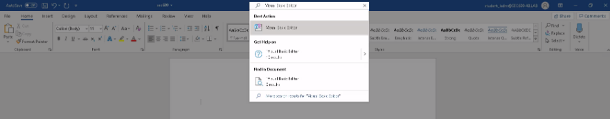

# Demonstrate

We'll demonstrate a very simple VBA macro that will execute calc.exe.
We will also illustrate how easy it is to detect these using simple logic.

1. **Creating a Malicius Word Document**
2. **Creating a new Macro**
From the new empty document, use Word's search-bar to open the "Visual Basic Editor" as shown below.

